# Portfolio — Code Structure & Architecture Guide

A comprehensive breakdown of every module, how they connect, and the logic driving this interactive portfolio site.

---

## Table of Contents

1. [High-Level Architecture](#1-high-level-architecture)
2. [Project File Map](#2-project-file-map)
3. [Boot Sequence](#3-boot-sequence)
4. [Module Deep-Dives](#4-module-deep-dives)
   - [index.html](#41-indexhtml--entry-point)
   - [main.js](#42-mainjs--bootstrap)
   - [renderer.js](#43-rendererjs--dom-orchestrator)
   - [themeManager.js](#44-thememanagerjs--theme-loader)
   - [portfolioData.js](#45-portfoliodatajs--data-layer)
   - [components.js (neo theme)](#46-componentsjs--neo-theme-components)
   - [styles.css (neo theme)](#47-stylescss--neo-theme-styles)
5. [Games & Interactions](#5-games--interactions)
   - [heroParticles.js](#51-heroparticlesjs)
   - [memoryMosaic.js](#52-memorymosaicjs)
   - [paperRocket.js](#53-paperrocketjs)
   - [timelineRunner.js](#54-timelinerunnerjs)
   - [retroPacman.js](#55-retropacmanjs)
6. [Data Flow](#6-data-flow)
7. [Theme System](#7-theme-system)
8. [Rendering Pipeline](#8-rendering-pipeline)
9. [Game Lifecycle Pattern](#9-game-lifecycle-pattern)
10. [CSS Architecture](#10-css-architecture)
11. [Key Design Decisions](#11-key-design-decisions)
12. [UI Refinements (refine-ui)](#12-ui-refinements-refine-ui-branch)

---

## 1. High-Level Architecture

The site is a **static single-page application** built with **vanilla JavaScript ES modules** — no build tools, no bundler, no framework. The browser loads native `<script type="module">` directly.

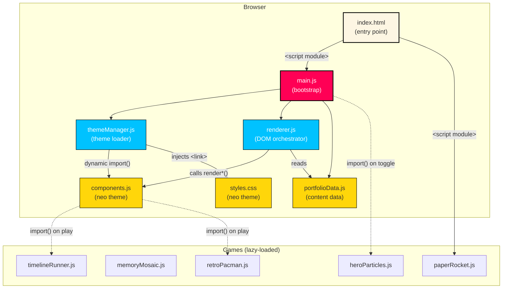

---

## 2. Project File Map

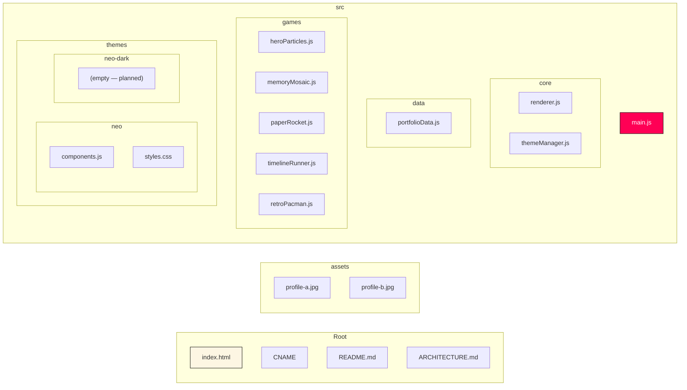

**Why this layout?**

| Folder | Purpose |
|--------|---------|
| `src/core/` | Framework-level modules that don't change per theme |
| `src/data/` | Pure data — no DOM, no logic |
| `src/themes/<name>/` | Each theme is a self-contained folder with its own `components.js` + `styles.css` |
| `src/games/` | Self-contained interactive modules, lazy-loaded when needed |
| `assets/` | Static images |

---

## 3. Boot Sequence

What happens from the moment the browser loads `index.html`:

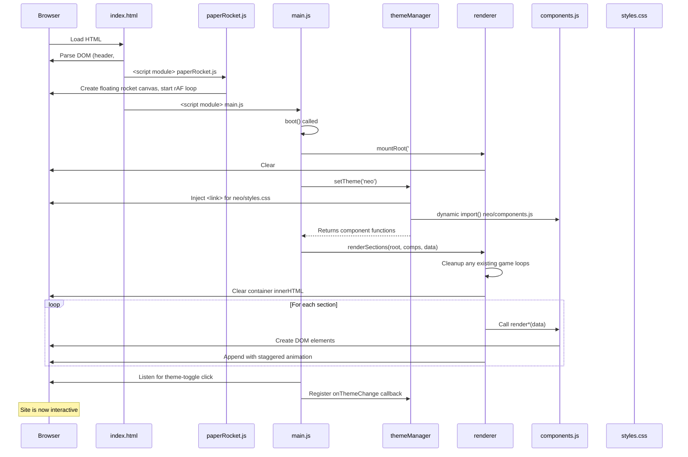

### Step-by-step:

1. **HTML parsed** → static header + empty `<main id="app">` + footer
2. **paperRocket.js** loads immediately (non-deferred `<script module>`), creates a full-viewport canvas, and starts animating a bouncing paper rocket emoji
3. **main.js** loads, calls `boot()`
4. `boot()` creates the root container inside `#app`
5. Asks `themeManager` to load the `'neo'` theme — this dynamically imports `components.js` and injects the CSS `<link>`
6. Calls `renderSections()` which iterates through a fixed order array and calls each component function
7. Wires the header "Game Mode" toggle button

---

## 4. Module Deep-Dives

### 4.1 `index.html` — Entry Point

```
┌──────────────────────────────────────┐
│  <head>                              │
│    • Meta tags (viewport, desc)      │
│    • Google Fonts (Inter)            │
│    • Favicon link                    │
│  </head>                             │
│                                      │
│  <body>                              │
│    ┌──── Skip Link ────┐             │
│    │  <a href="#site-root">          │
│    └───────────────────┘             │
│                                      │
│    ┌──── Header (static) ──────┐     │
│    │  Site title + Game Mode   │     │
│    │  toggle button            │     │
│    └───────────────────────────┘     │
│                                      │
│    ┌──── <main id="app"> ──────┐     │
│    │  (empty — JS fills this)  │     │
│    └───────────────────────────┘     │
│                                      │
│    ┌──── Footer (static) ──────┐     │
│    │  © Praveen Ramesh         │     │
│    └───────────────────────────┘     │
│                                      │
│    <script> paperRocket.js           │
│    <script> main.js                  │
│  </body>                             │
└──────────────────────────────────────┘
```

Key points:
- **No build step** — raw `.js` files served as ES modules
- Header is **outside** `#app`, so it's never re-rendered
- The `skip-link` targets `#site-root` which is created dynamically by the renderer

---

### 4.2 `main.js` — Bootstrap

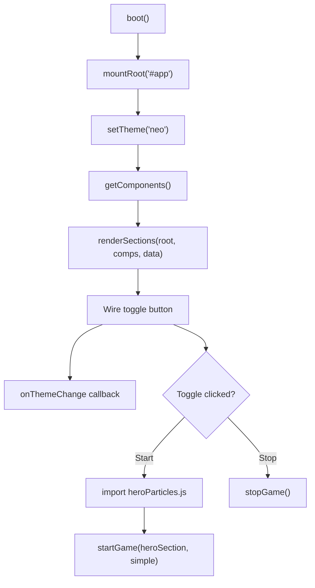

**What it does:**
1. Imports static data + core modules
2. Mounts the root DOM container
3. Loads the default theme
4. Renders all sections
5. Wires the "Game Mode" header button to toggle hero particles
6. Registers a theme-change listener for future hot-swapping

---

### 4.3 `renderer.js` — DOM Orchestrator

Two exported functions:

#### `mountRoot(selector)`
- Finds `<main id="app">`
- Clears it
- Creates a `<div id="site-root">` container
- Returns the container

#### `renderSections(container, components, data)`

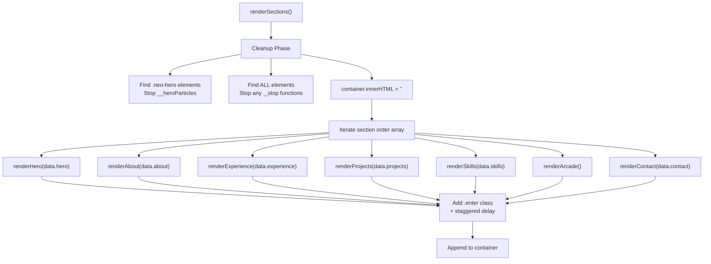

**Section order** is defined as a fixed array:
```js
const order = [
  { fn: 'renderHero',       data: data.hero },
  { fn: 'renderAbout',      data: data.about },
  { fn: 'renderExperience', data: data.experience },
  { fn: 'renderProjects',   data: data.projects },
  { fn: 'renderSkills',     data: data.skills },
  { fn: 'renderArcade',     data: null },
  { fn: 'renderContact',    data: data.contact },
];
```

Each component function returns a DOM `<section>` element. The renderer adds an `.enter` CSS class for slide-up animation with staggered delays (80ms apart).

**Cleanup logic** before re-rendering:
- Scans for hero particle systems (`__heroParticles`)
- Scans ALL elements for `_stop` function references (game loops, etc.)
- Calls each stop function to prevent orphaned `requestAnimationFrame` loops

---

### 4.4 `themeManager.js` — Theme Loader

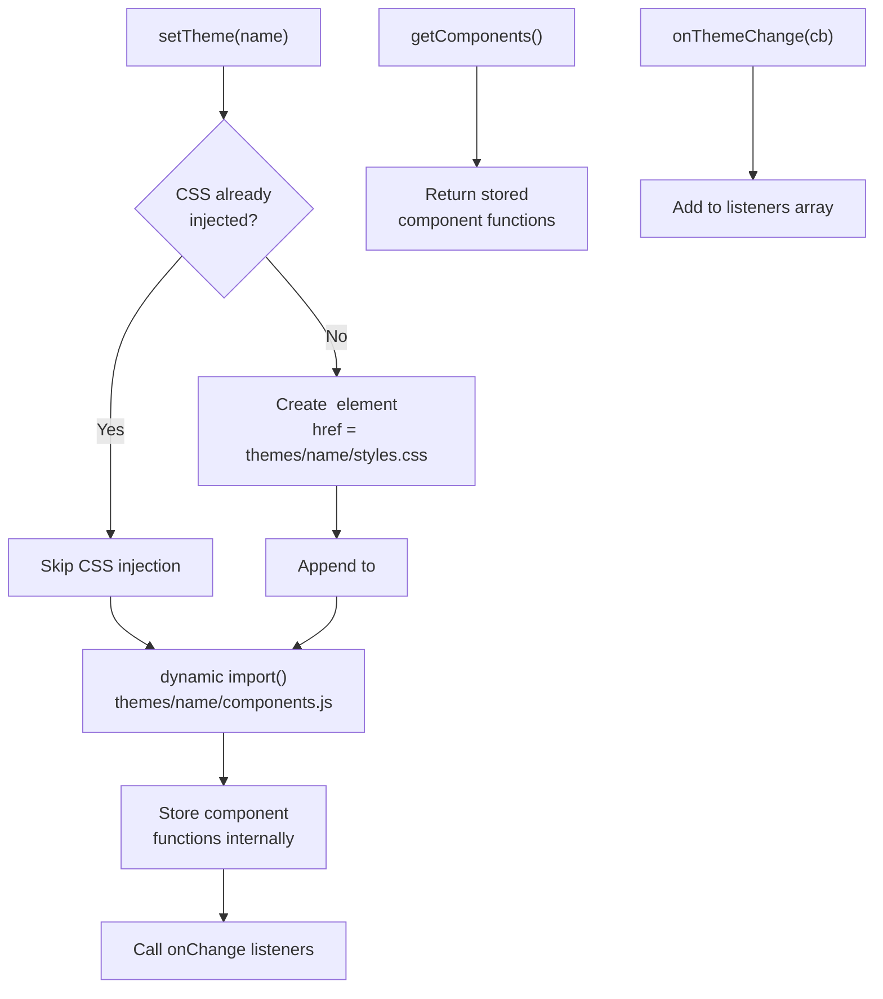

**How theme swapping works:**
1. `setTheme('neo')` → injects `<link>` for `themes/neo/styles.css` + `import()` for `themes/neo/components.js`
2. Components module exports named functions: `renderHero`, `renderAbout`, etc.
3. These functions are stored and returned via `getComponents()`
4. Any registered `onThemeChange` callbacks fire, triggering a full re-render

The `neo-dark` theme folder exists but is empty — it's a placeholder for a future dark theme.

---

### 4.5 `portfolioData.js` — Data Layer

Pure static data object with zero logic:

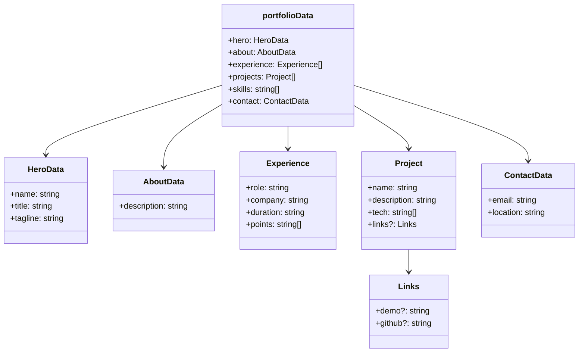

**Projects with links:**
- **Auto Sprint** → `https://praveenramesh.itch.io/auto-sprint`
- **The Lone Ranger JD** → `https://praveenramesh.itch.io/the-lone-ranger-jd`

---

### 4.6 `components.js` — Neo Theme Components

Each function follows the same pattern:

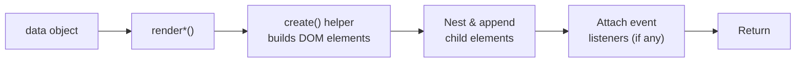

#### `create(tag, cls, attrs)` helper
A tiny DOM factory:
```js
const el = document.createElement(tag);
if (cls) el.className = cls;
Object.entries(attrs).forEach(([k, v]) => el.setAttribute(k, v));
return el;
```

#### Component Registry

| Function | Section | Key Features |
|----------|---------|--------------|
| `renderHero(data)` | Hero banner | Profile image with hover/touch swap, deco block |
| `renderAbout(data)` | About paragraph | Simple text section |
| `renderExperience(items)` | Work timeline | Cards with role, company, duration, bullet points |
| `renderProjects(items)` | Project grid | Cards with tech badges, project links, optional mini-game |
| `renderSkills(items)` | Skill pills | Styled buttons with skill names |
| `renderArcade()` | Arcade game | Lazy-loads retro Pac-Man in an arcade cabinet |
| `renderContact(data)` | Contact card | Email link, location, copy-to-clipboard button |

#### `renderHero` — Profile Image Swap

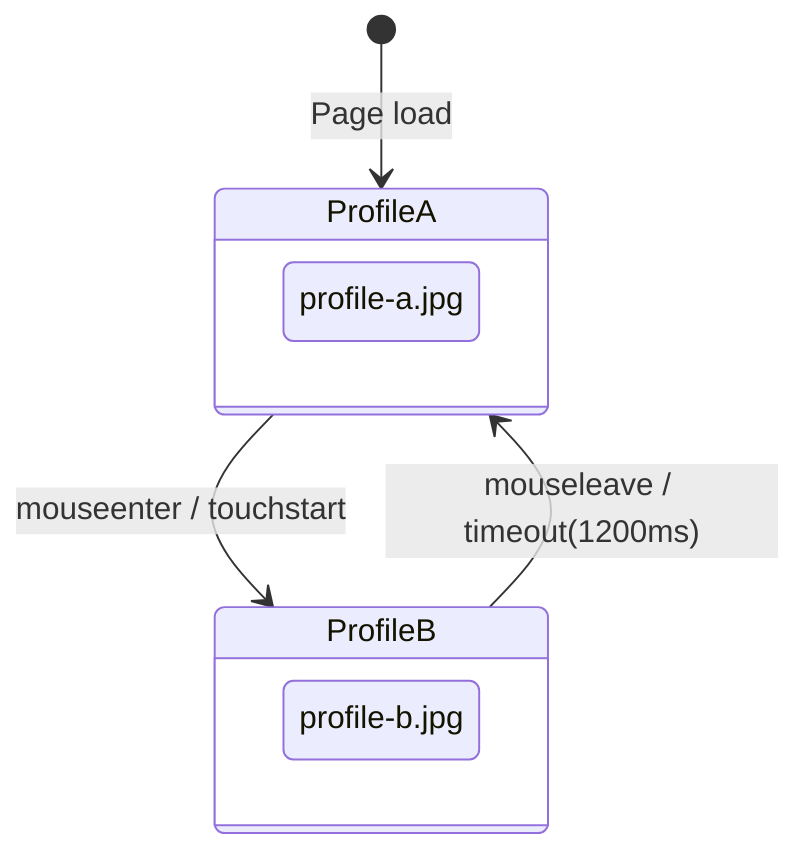

#### `renderProjects` — Card Structure

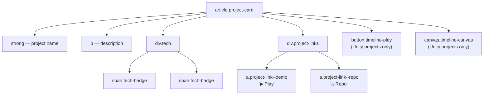

#### `renderArcade` — Lazy Game Loading

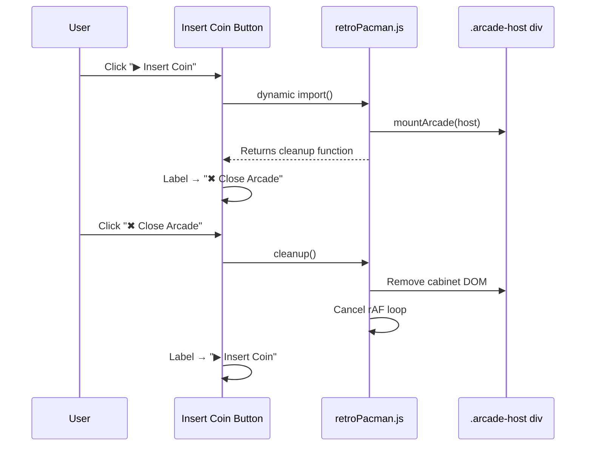

---

### 4.7 `styles.css` — Neo Theme Styles

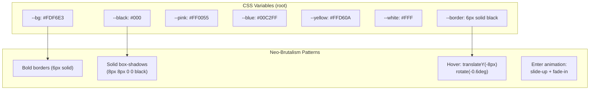

**Key style categories:**

| Category | Classes | Description |
|----------|---------|-------------|
| Layout | `.container`, `#site-root` | Max-width 1100px centered |
| Cards | `.box`, `.card` | Bold border + shadow pattern |
| Hero | `.neo-hero`, `.hero-*` | Profile image positioning, deco block |
| Projects | `.projects-grid`, `.project-card` | CSS Grid, 1col → 2col at 720px |
| Tech Badges | `.tech-badge`, `.tech-*` | Color-coded per technology |
| Project Links | `.project-link`, `--demo`, `--repo` | Styled anchor buttons |
| Skills | `.skills-list`, `.skill` | Flexbox wrap of pill buttons |
| Games | `.timeline-*` | Canvas + play button styling |
| Arcade | `.neo-arcade`, `.arcade-*` | Arcade section styles |
| Animation | `.enter`, `@keyframes enter` | Staggered entrance effects |
| Accessibility | `@media prefers-reduced-motion` | Disables animations |
| Responsive | `@media (min-width: 720px)` | Grid + sizing breakpoints |

---

## 5. Games & Interactions

### 5.1 `heroParticles.js`

**What:** A canvas-based particle game overlaid on the hero section. Colorful particles float around; the user clicks/taps to remove them.

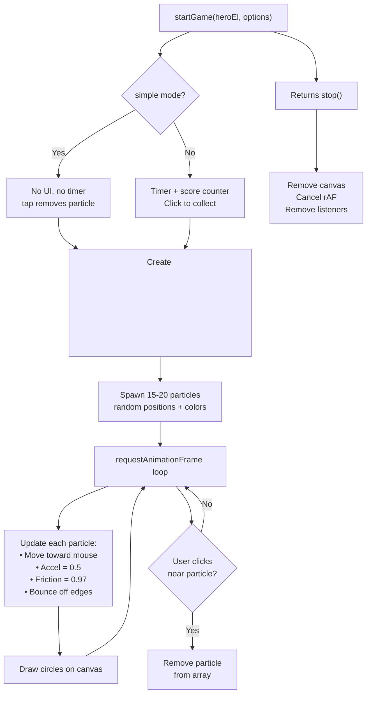

**Particle physics:**
- Each particle has `x, y, vx, vy, radius, color`
- Velocity moves toward cursor with `acceleration = 0.5`
- `friction = 0.97` damps velocity
- Bounces off canvas edges

---

### 5.2 `memoryMosaic.js`

**What:** A memory card matching game. Flip cards to find pairs.

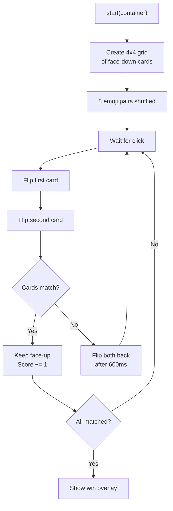

---

### 5.3 `paperRocket.js`

**What:** A decorative floating paper rocket (🚀) that bounces around the full viewport. Purely cosmetic — no interaction needed.

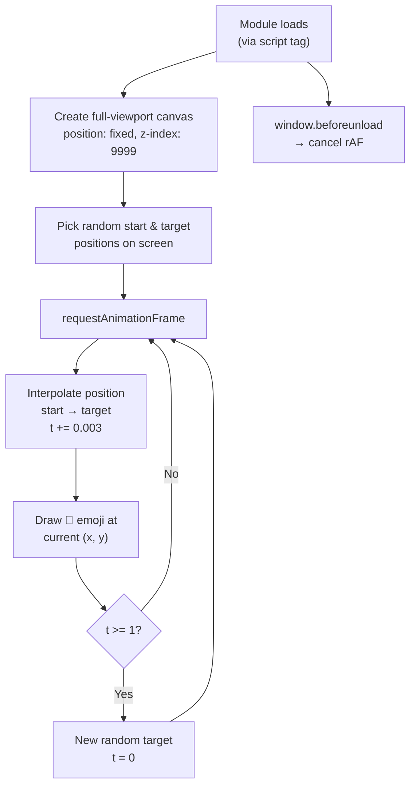

**Known bug:** `current` is referenced before declaration inside the `step()` function when `t >= 1` — this causes a `ReferenceError` on the first segment completion.

---

### 5.4 `timelineRunner.js`

**What:** A side-scrolling runner mini-game attached to the Unity project card. The player jumps over obstacles that represent experience cards.

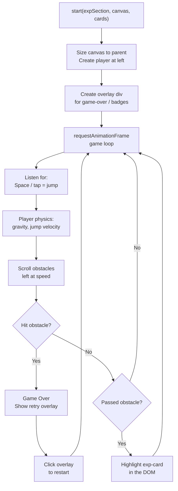

---

### 5.5 `retroPacman.js`

**What:** A full retro Pac-Man game rendered inside an arcade cabinet UI.

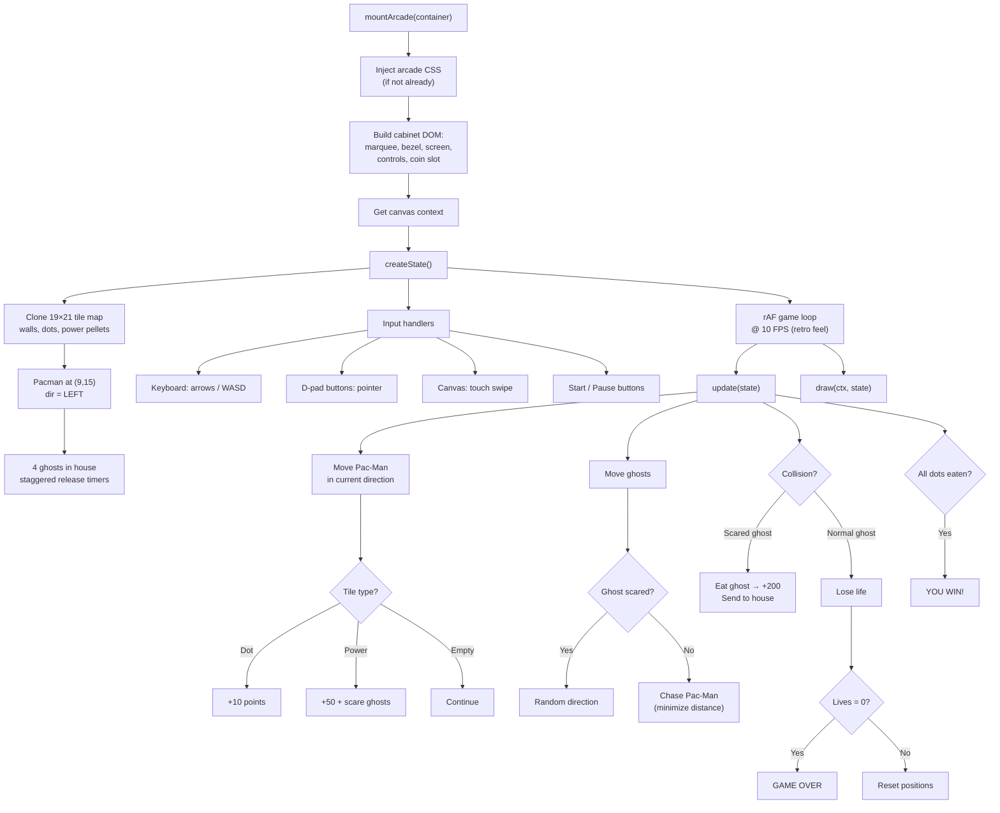

#### Arcade Cabinet DOM Structure

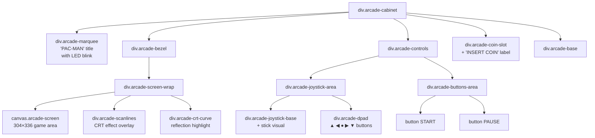

#### Game Map Layout (19×21 tiles)

```
0 = wall (blue)    1 = dot    2 = power pellet    3 = empty    4 = ghost house

Row  0: ███████████████████
Row  1: █·····   ·   · · ·█
Row  2: █○██·███·█·███·██○█
Row  3: █·················█
Row  4: █·██·█·███·█·██·█·█
Row  5: █····█···█···█····█
Row  6: ████·███ █ ███·████
Row  7: ████·█       █·████
Row  8: ████·█ ██G██ █·████
Row  9:     ·  █GGG█  ·     ← tunnel
Row 10: ████·█ █████ █·████
Row 11: ████·█       █·████
Row 12: ████·█ █████ █·████
Row 13: █·················█
Row 14: █·██·███·█·███·██·█
Row 15: █○·█·····P·····█·○█  ← Pac-Man start
Row 16: ██·█·█·███·█·█·█·██
Row 17: █····█···█···█····█
Row 18: █·██████·█·██████·█
Row 19: █·················█
Row 20: ███████████████████
```

---

## 6. Data Flow

How data moves through the system from source to screen:

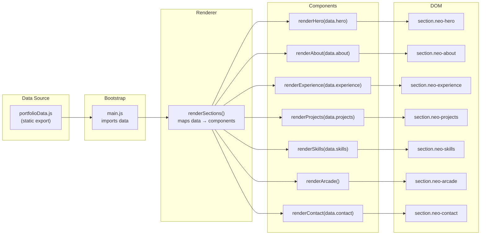

---

## 7. Theme System

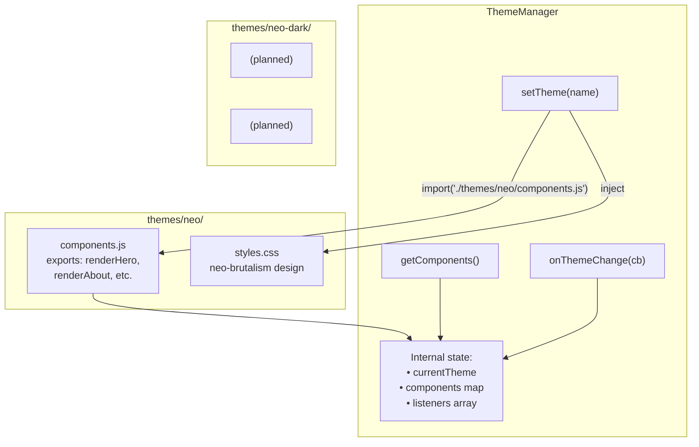

**Adding a new theme:**

1. Create `src/themes/my-theme/components.js` — export the same function names
2. Create `src/themes/my-theme/styles.css` — define styles for the same class names
3. Call `themeManager.setTheme('my-theme')` — it auto-discovers the files by convention

---

## 8. Rendering Pipeline

```mermaid
flowchart TD
    TRIGGER["Trigger:<br/>• Initial boot<br/>• Theme change"] --> CLEANUP["Cleanup Phase"]

    subgraph Cleanup
        CLEANUP --> HERO_STOP["Stop hero particle<br/>systems"]
        CLEANUP --> ALL_STOP["Stop ALL elements<br/>with _stop()"]
        CLEANUP --> CLEAR["innerHTML = ''"]
    end

    CLEAR --> BUILD["Build Phase"]

    subgraph Build ["For each section in order"]
        BUILD --> CALL["components.renderX(data)"]
        CALL --> DOM["Returns <section> element"]
        DOM --> ANIMATE["Add .enter class<br/>delay = index × 80ms"]
        ANIMATE --> APPEND["Append to #site-root"]
    end

    APPEND --> DONE["Rendering complete"]
```

---

## 9. Game Lifecycle Pattern

All games follow a consistent pattern:

```mermaid
stateDiagram-v2
    [*] --> Idle: Module not loaded

    Idle --> Loading: User clicks trigger
    Loading --> Running: import() resolves
    Running --> Running: rAF loop
    Running --> Paused: Pause action
    Paused --> Running: Resume
    Running --> Stopped: User stops / cleanup called

    Stopped --> Idle: DOM removed

    state Running {
        [*] --> Update
        Update --> Draw
        Draw --> WaitFrame
        WaitFrame --> Update: next rAF
    }
```

**Pattern:**
```js
// Every game module exports a start function
export function startGame(container, options) {
  // 1. Create canvas/DOM
  // 2. Initialize state
  // 3. Setup input listeners
  // 4. Start rAF loop

  return function stop() {
    // 5. Cancel rAF
    // 6. Remove event listeners
    // 7. Remove DOM elements
  };
}
```

The returned `stop()` function is stored by the caller (button handler or renderer cleanup) and called when the game needs to be torn down. This prevents orphaned animation frames and memory leaks.

---

## 10. CSS Architecture

```mermaid
graph TD
    subgraph Global ["index.html (no global CSS)"]
        GF["Google Fonts: Inter"]
    end

    subgraph Theme CSS ["themes/neo/styles.css"]
        VARS["CSS Variables<br/>--bg, --black, --pink, etc."]
        RESET["Box-sizing reset<br/>Body margin/padding"]
        LAYOUT["Layout classes<br/>.container, #site-root"]
        COMPS["Component classes<br/>.neo-hero, .card, etc."]
        BADGES["Tech badge colors<br/>.tech-flutter, etc."]
        LINKS["Project link styles<br/>.project-link, etc."]
        ANIM["Animations<br/>.enter, @keyframes"]
        A11Y["Accessibility<br/>prefers-reduced-motion"]
        RESP["Responsive<br/>@media min-width: 720px"]
    end

    subgraph Game CSS ["Injected at runtime"]
        PACMAN["retroPacman.js<br/>injects #retro-pacman-css"]
    end

    GF --> VARS
    VARS --> RESET --> LAYOUT --> COMPS --> BADGES --> LINKS --> ANIM --> A11Y --> RESP
```

**Neo-Brutalism design tokens:**
- **Bold borders:** 6px solid black on everything
- **Solid shadows:** `8px 8px 0 0 black` (no blur)
- **Bright accent colors:** Pink `#FF0055`, Blue `#00C2FF`, Yellow `#FFD60A`
- **Hover effect:** `translateY(-8px) rotate(-0.6deg)` — elements "lift" and tilt
- **Entrance animation:** `translateY(12px) → 0` with opacity fade

---

## 11. Key Design Decisions

| Decision | Rationale |
|----------|-----------|
| **No build tools** | Simplicity — native ES modules work in all modern browsers. Zero config, zero dependencies. |
| **Dynamic `import()`** for games | Games are heavy; lazy-loading keeps initial page load fast. Code only downloads when the user interacts. |
| **Theme as folder convention** | Each theme is self-contained. Adding a theme = adding a folder with 2 files. No config needed. |
| **`_stop()` cleanup pattern** | Prevents memory leaks from `requestAnimationFrame` loops when sections re-render or games close. |
| **CSS variables for design tokens** | Makes future theme variants easy — override variables without rewriting selectors. |
| **`create()` helper vs innerHTML** | DOM API is safer (no XSS risk) and gives typed references for event listeners. |
| **7 FPS for Pac-Man** | Neutral retro game feel — reduced from 10 FPS for a more relaxed play speed. |
| **Arcade CSS injected by JS** | The arcade game is optional; its styles only load when the module is imported. Avoids bloating the theme CSS. |
| **Profile orbit animation** | CSS `@keyframes profileOrbit` rotates an icon 360° around the hero profile image in 4s loop. |

---

## 12. UI Refinements (refine-ui branch)

This section documents the 8 UI/UX refinements applied in the `refine-ui` branch.

### 12.1 Arcade moved to header

The bottom arcade section (`renderArcade`) was removed. Instead, a small retro arcade-machine SVG icon sits in the header next to "Praveen Ramesh". Clicking it opens a full-screen overlay that dynamically imports and mounts the Pac-Man game.

```mermaid
sequenceDiagram
    participant U as User
    participant H as Header Icon
    participant O as Overlay
    participant P as retroPacman.js

    U->>H: Click arcade icon
    H->>O: Create .arcade-overlay (full-screen)
    O->>P: Dynamic import() + mountArcade()
    P-->>O: Game renders inside overlay
    U->>O: Click ✕ close
    O->>P: stopFn() cleanup
    O->>O: Remove overlay from DOM
```

### 12.2 Animated animals from accent block

Below the hero meta section, a row of animal emojis (🐇🦊🐈🐕🐿️) run rightward from the red accent block in a staggered infinite loop using CSS `@keyframes animalRun`. Each animal has an increasing `animation-delay` (1.8s apart).

### 12.3 Terminal minimize / close animations

The experience terminal gained window-control buttons:
- **Minimize (−):** Toggles between the full terminal body and a compact view showing only company names and durations.
- **Close (×):** Shrinks the terminal to zero scale and opacity, then pops it back open after 1 second using `@keyframes terminalPop`.

### 12.4 Skill blast animation

Clicking any skill node triggers:
1. 12 radial particles burst outward from the node's center (`@keyframes skillParticleBurst`)
2. The node itself disappears (`skill-blasting` class)
3. After 700ms, the node reappears with a scale pop effect (`skill-reappear` class)

### 12.5 Project cards — anime avatars, 3D tilt, consistent layout

```mermaid
graph LR
    subgraph Card["project-card-3d"]
        BODY["project-card-body"]
        FOOTER["project-card-footer"]
    end

    BODY --> A["Anime SVG Avatar"]
    BODY --> T["Title"]
    BODY --> D["Description"]
    BODY --> TB["Tech Badges"]

    FOOTER --> L["Play / Repo links"]
    FOOTER --> V["View More btn"]
```

- **Anime-style SVG avatars** replace letter-initial circles. Four variants matched by tech: Flutter (blue character), Unity (dark character), JavaScript (yellow character with JS hat), and a default pink character.
- **3D perspective tilt** on `mousemove` — calculates cursor position relative to card and applies `perspective(600px) rotateY() rotateX() scale(1.02)`. Resets on `mouseleave`.
- **Consistent footer layout** — cards now use `project-card-body` (flex-grow, pushes content up) and `project-card-footer` (pinned to bottom via `margin-top:auto`) so Play buttons and View More align across all cards regardless of content height.

### 12.6 Bottom arcade removed

`renderArcade()` function deleted from `components.js`. The `{ fn: 'renderArcade', data: null }` entry removed from `renderer.js` section order array. The arcade is accessible only via the header icon now.

### 12.7 Kite removed, profile orbit + mobile tap toggle

- **Paper rocket (kite) removed:** `<script>` tag for `paperRocket.js` removed from `index.html`. The floating decorative rocket no longer appears.
- **Profile orbit:** An ⚡ icon orbits the hero profile image using `@keyframes profileOrbit` (4s linear infinite rotation). The orbit wrap is absolutely positioned over the profile.
- **Mobile tap toggle:** On touch devices, tapping the profile image now toggles between `profile-a.jpg` and `profile-b.jpg` (sticky toggle instead of the previous auto-revert after 1.2s).

### 12.8 Refined contact section

The contact section was redesigned as a neo-brutal card:
- Envelope SVG icon at the top
- Labeled rows for Email (clickable mailto link) and Location
- Horizontal divider
- Two action buttons: "📋 Copy Email" (clipboard API with ✅ success state) and "🚀 Say Hello" (mailto link)
- Hover lift + box-shadow effect on buttons
- Mobile-responsive: buttons stack vertically on small screens

---

*Updated for the `refine-ui` branch — Feb 2026*
